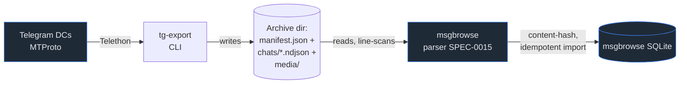

# ADR-0001: tg-export is a standalone delegate exporter, not a msgbrowse module

## Context and Problem Statement

msgbrowse ingests chat history from multiple providers (Signal, iMessage, WhatsApp) and holds one hard architectural rule: it does **not** write exporters. Extraction is always delegated to a dedicated, provider-targeted tool whose on-disk output msgbrowse parses. Telegram had no such delegate — the off-the-shelf options failed on inspection (tdl drops non-`--raw` message senders and `--raw` leaks MTProto wire structure; Telegram Desktop's export is a manual, non-automatable dump). How should Telegram extraction be built so it fits the msgbrowse model without dragging Telegram's protocol into msgbrowse?

## Decision Drivers

* msgbrowse must stay a reader of files on disk; it must never link a Telegram/MTProto client.
* The coupling surface between the two projects must be small, explicit, and one-directional.
* The exporter must be independently useful and independently testable (no import of msgbrowse, no hard-coded msgbrowse paths).
* Telegram-specific concerns (sessions, flood-waits, MTProto churn) must be quarantined in one place.

## Considered Options

* **A — Standalone delegate tool** (`joestump/tg-export`) that emits a curated JSON archive msgbrowse ingests.
* **B — A Telegram module inside msgbrowse** that calls Telethon directly.
* **C — Fork/adapt an existing tool** (tdl or a Telegram Desktop export parser).

## Decision Outcome

Chosen option: **A — standalone delegate tool**, because it is the only option that honors the msgbrowse "no exporters" rule while giving Telegram the fidelity the other tools lack. tg-export owns the MTProto and session surface — appropriate *in a dedicated exporter*, precisely how `signal-export` owns Signal's Desktop key material. msgbrowse stays a reader of files on disk. The sole coupling is the JSON contract (see ADR-0003, ADR-0004), and it flows one way: files out.

### Consequences

* Good — msgbrowse never gains a Telegram/MTProto dependency; the protocol's churn is quarantined in tg-export.
* Good — tg-export ships and versions independently; it is pip-installable and testable in isolation.
* Good — the same ingestion pattern already proven for Signal/iMessage/WhatsApp is reused unchanged.
* Bad — two repos to keep in lockstep on the schema (mitigated by ADR-0004's shared JSON Schema + `schema_version`).
* Bad — a second tool to package and bundle into msgbrowse's environment (accepted; see ADR-0010).

### Confirmation

The package imports nothing from msgbrowse and hard-codes none of its paths — verified by the test suite (no msgbrowse import) and by the dependency list in `pyproject.toml`. The only artifact crossing the boundary is the directory tree defined in SPEC-0001.

## Pros and Cons of the Options

### A — Standalone delegate tool

* Good — matches the msgbrowse architecture exactly; zero protocol coupling.
* Good — independently useful to anyone wanting curated Telegram JSON.
* Good — clean security boundary: session/auth material lives only here.
* Neutral — requires defining and versioning an explicit contract.
* Bad — coordination cost across two repos on schema changes.

### B — Telegram module inside msgbrowse

* Good — one repo, no contract to version.
* Bad — violates the core msgbrowse rule; pulls MTProto and session handling into the reader.
* Bad — Telegram protocol churn now lands in msgbrowse's release cadence and test surface.

### C — Fork an existing tool

* Good — less code to write up front.
* Bad — tdl's JSON lacks senders outside `--raw`, and `--raw` emits the wire dump — neither is ingestion-ready.
* Bad — Telegram Desktop's export is manual; no one-click, no automation.

## Architecture Diagram

## More Information

The JSON contract is defined in SPEC-0001 and governed by ADR-0003 (directory/NDJSON shape) and ADR-0004 (`schema_version` lockstep). The consuming side is msgbrowse SPEC-0015 (story #209). This ADR is the parent decision; ADR-0002 (engine), ADR-0003 (output), and ADR-0009 (security) all build on it.
