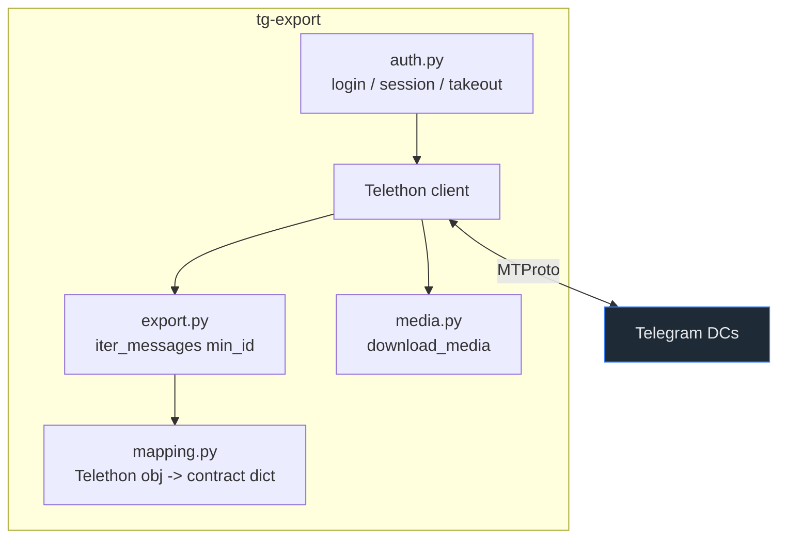

# ADR-0002: Use Telethon (MTProto) as the extraction engine

## Context and Problem Statement

tg-export must read a full Telegram account's history — private chats, groups, supergroups, and (opt-in) channels — with resolved senders, service events, reactions, replies, forwards, and media. Which client library should drive extraction, given that the existing tooling (tdl, Telegram Desktop export) was already rejected in ADR-0001?

## Decision Drivers

* Full fidelity: senders must always resolve, not just in a raw-dump mode.
* Non-interactive, automatable operation after a one-time login.
* A sanctioned bulk-export path with forgiving rate limits for large historical pulls.
* Pure-Python, cross-platform, small dependency tree (it ships inside a `.app` bundle — see ADR-0010).
* Read-only access to messages and media; no send/edit/delete.

## Considered Options

* **A — Telethon** (async MTProto client for Python).
* **B — Pyrogram** (another Python MTProto client).
* **C — Bot API** (HTTP Bot API via a bot token).

## Decision Outcome

Chosen option: **A — Telethon**, because it is a mature, pure-Python MTProto client that authenticates as the *user account* (required — the Bot API cannot read a user's own dialog history), exposes `iter_messages(min_id=...)` for incremental anchoring (ADR-0008), `download_media` for attachments, and a **takeout session** (`client.takeout(...)`) — Telegram's sanctioned data-export mode with more forgiving flood limits for large first exports. It owns the MTProto and session surface cleanly, which is exactly what a dedicated exporter should own (ADR-0001).

### Consequences

* Good — user-account auth yields full history and resolved senders.
* Good — takeout mode reduces flood-waits on large initial pulls.
* Good — pure Python, no compiled extensions; fits the pinned, pip-installable bundle.
* Bad — MTProto requires an `api_id`/`api_hash` app credential and a persisted session file, which becomes the sensitive artifact (managed per ADR-0009) and a credential decision (ADR-0006).
* Neutral — async API; the CLI wraps it behind synchronous command entry points.

### Confirmation

The tool authenticates over MTProto and completes a full + incremental export against a real account during bring-up; the test suite mocks the Telethon client and feeds synthetic message/dialog objects, so no network is required in CI.

## Pros and Cons of the Options

### A — Telethon

* Good — mature, well-documented, pure Python, active maintenance.
* Good — first-class takeout session and `min_id` incremental iteration.
* Good — direct `download_media` with type classification.
* Bad — carries the `api_id`/`api_hash` + session-file burden.

### B — Pyrogram

* Good — also a capable MTProto client.
* Neutral — comparable feature set to Telethon.
* Bad — takeout support and community momentum weaker; no compelling reason to switch given Telethon meets every driver.

### C — Bot API

* Good — simplest auth (a bot token), no session file.
* Bad — a bot cannot read a user's own historical dialogs; fundamentally cannot satisfy full-account export. Disqualifying.

## Architecture Diagram

## More Information

Credential sourcing is decided in ADR-0006; session-file security in ADR-0009; incremental anchoring in ADR-0008. Builds on ADR-0001.
