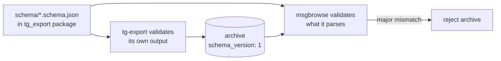

# ADR-0004: Version the contract with `schema_version` and ship JSON Schema in-package

## Context and Problem Statement

tg-export's output is consumed by a separately-developed parser in msgbrowse (SPEC-0015, story #209). The two are built in parallel and must stay in lockstep: if a field's meaning changes, both sides must change together, and neither should silently diverge. How is the contract versioned and validated so both repos agree on one source of truth?

## Decision Drivers

* One source of truth for the field-level shape, usable by both repos' tests.
* An explicit, coordinated version signal so a consumer can reject an archive it doesn't understand.
* Determinism — re-exporting the same message must produce byte-identical field values, because msgbrowse content-hashes each message to dedupe re-imports.
* Machine-checkability in CI on both sides.

## Considered Options

* **A — `schema_version: 1` integer + JSON Schema files shipped inside the package.**
* **B — Prose contract only** (documented in README/spec, no machine schema).
* **C — Semantic version string** for the schema (e.g., `"1.2.0"`) with a compatibility range.

## Decision Outcome

Chosen option: **A**. Every `manifest.json` carries `schema_version: 1` (an integer major); msgbrowse rejects a manifest whose major it doesn't recognize. The field-level contract is expressed as JSON Schema files (`manifest.schema.json`, `message.schema.json`) shipped *inside* the `tg_export` package, so msgbrowse's parser tests can validate against the exact same schema tg-export validates its own output against. A field change is a coordinated `schema_version` bump on both sides — never a silent divergence.

To keep the hash-dedupe on the msgbrowse side correct, message field values MUST be deterministic: no run-varying fields (`downloaded_at`), no absolute paths, no ordering nondeterminism. Re-exporting the same message yields byte-identical output.

### Consequences

* Good — one executable contract; both repos validate against identical schema files.
* Good — an integer major gives a crisp, cheap compatibility gate.
* Good — determinism makes idempotent re-import safe by construction.
* Bad — schema changes require synchronized releases across two repos (the coordination cost is the point).
* Neutral — an integer major is coarse; minor/additive changes ride within a major and are handled by tolerant readers.

### Confirmation

CI validates every emitted `manifest.json` and message object against the shipped JSON Schema (`jsonschema`). A determinism test re-exports the same synthetic messages twice and asserts byte-identical ndjson. The schema files are published in the wheel so msgbrowse can import them.

## Pros and Cons of the Options

### A — Integer `schema_version` + shipped JSON Schema

* Good — machine-checkable, single source of truth, cheap compatibility gate.
* Good — decouples release timing detail from a crisp major signal.
* Bad — requires disciplined coordinated bumps.

### B — Prose contract only

* Good — zero tooling.
* Bad — no machine validation; drift is discovered at ingest time, in production, not in CI.

### C — Semantic version string with ranges

* Good — expressive (major/minor/patch).
* Bad — invites fuzzy "compatible range" logic on the consumer; the brief's model is a single integer major with a hard reject, which is simpler and sufficient for two coordinated repos.

## Architecture Diagram

## More Information

The full field tables are in SPEC-0001. Output structure is ADR-0003. Link-URL resolution (a determinism-sensitive field) is ADR-0005. Consumed by msgbrowse SPEC-0015.
