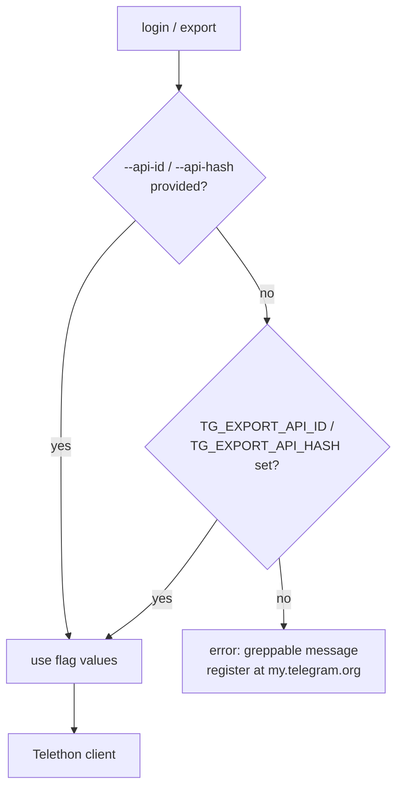

> **Superseded by [ADR-0011](ADR-0011-tdl-raw-transform-pivot.md).** The transform
> holds no Telegram API credential of its own — auth is tdl's job against an installed
> Telegram Desktop session. The credential-sourcing decision below is retained for
> history.

# ADR-0006: Default to per-user Telegram API credentials; support both sourcing modes

## Context and Problem Statement

Telethon authenticates over MTProto with an `api_id`/`api_hash` app credential (distinct from the per-account login). This credential can either be **shared** — one credential bundled with msgbrowse for all users — or **per-user** — each user registers their own app at my.telegram.org. Which is the default? (Confirmed decision, build brief §13.)

## Decision Drivers

* No secret may be hard-coded in the source (security invariant, ADR-0009).
* Minimize Telegram ToS exposure — a shared app credential across unrelated users is a mild grey area.
* Reasonable first-run UX.
* The build must support both modes regardless of the default, so operators can choose.

## Considered Options

* **A — Per-user credential as the default**: user registers at my.telegram.org; supplied via `--api-id`/`--api-hash` flags or `TG_EXPORT_API_ID`/`TG_EXPORT_API_HASH` env vars.
* **B — Shared credential bundled with msgbrowse** as the default.

## Decision Outcome

Chosen option: **A — per-user by default**. Each user registers their own app credential; the tool reads it from flags or the `TG_EXPORT_API_*` env vars. This keeps tg-export free of any embedded secret, sidesteps the shared-credential ToS grey area, and costs one extra one-time setup step. The build still **supports both** — an operator who wants to ship a shared credential can supply it the same way (env/flags) — so the default is a policy choice, not a code constraint. No credential is ever written into the source tree.

### Consequences

* Good — zero embedded secrets; cleanest ToS posture.
* Good — credential sourcing is uniform (flags or env), so "shared" remains possible by just providing shared values.
* Bad — one extra setup step for a new user (register an app once).
* Neutral — documentation must walk a first-timer through my.telegram.org registration.

### Confirmation

The source contains no `api_id`/`api_hash` literal (grep-verified in tests/CI). `login` and `export` resolve the credential from flags then env, erroring with a clear, greppable message if neither is present. README documents the my.telegram.org registration.

## Pros and Cons of the Options

### A — Per-user default

* Good — no shared secret to leak or rotate; no ToS grey area.
* Good — the "shared" path still works via the same env/flags, so nothing is foreclosed.
* Bad — slightly higher first-run friction.

### B — Shared default

* Good — simplest first-run UX (nothing to register).
* Bad — a shared credential across unrelated users is a mild Telegram ToS grey area.
* Bad — creates a secret that must be distributed and rotated; tension with "no hard-coded secret."

## Architecture Diagram

## More Information

Session-file and secret-handling invariants are in ADR-0009. Engine choice (why a credential is needed at all) is ADR-0002. Confirmed with Joe: default per-user, build supports both.
