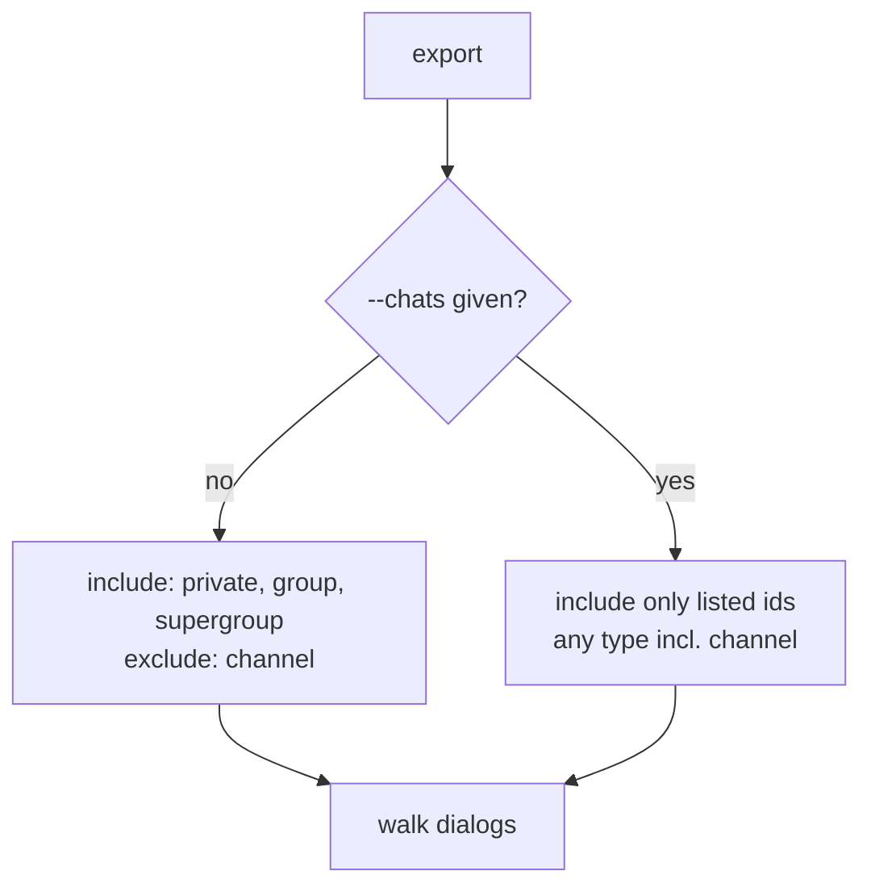

# ADR-0007: Export non-channel dialogs by default; channels are opt-in

## Context and Problem Statement

A user's subscribed channels (broadcast) can be enormous and low-value for a personal archive, whereas their private chats, groups, and supergroups are the high-value core. Should a default `export` include channels, or restrict to non-channel dialogs with channels opt-in? (Confirmed decision, build brief §13.)

## Decision Drivers

* Keep the default export bounded and personally relevant.
* Avoid pulling gigabytes of broadcast content nobody asked for.
* Preserve the ability to grab a specific channel when wanted.
* Predictable, explicit behavior — no surprising scope.

## Considered Options

* **A — Default to non-channel dialogs (private, group, supergroup); channels opt-in via `--chats ID,...`.**
* **B — Export everything, including all subscribed channels, by default.**

## Decision Outcome

Chosen option: **A**. `export` defaults to private chats, groups, and supergroups. Channels are excluded from the default sweep and included only when explicitly named via `--chats`. This keeps a routine full export bounded and personal while still allowing a deliberate pull of a specific channel. `--chats ID,ID,...` restricts the run to exactly the listed chats regardless of type, so it doubles as the channel opt-in.

### Consequences

* Good — default exports stay relevant and reasonably sized.
* Good — no accidental multi-GB broadcast archives.
* Good — a wanted channel is one `--chats <id>` away.
* Bad — a user who *does* want all channels must name them (or a future `--include-channels` flag could be added; out of scope for v1).
* Neutral — `chats` discovery (`tg-export chats`) lists all dialogs including channels so the user can find ids to opt in.

### Confirmation

An export test with a synthetic dialog set containing a channel asserts the channel is absent from the default run and present when its id is passed to `--chats`. The `chats` command lists channels so they are discoverable.

## Pros and Cons of the Options

### A — Non-channel default, channel opt-in

* Good — bounded, relevant default; explicit opt-in for the large/low-value case.
* Good — reuses `--chats` as the opt-in mechanism (no new concept).
* Bad — no single flag to grab "all channels" in v1.

### B — Everything by default

* Good — nothing to remember; truly full account.
* Bad — can be enormous and mostly low-value for a personal archive.
* Bad — surprising cost on the first export.

## Architecture Diagram

## More Information

Dialog discovery and the `--chats` surface are specified in SPEC-0001 (CLI). Output structure is ADR-0003. Confirmed with Joe: default to non-channel, allow opt-in.
