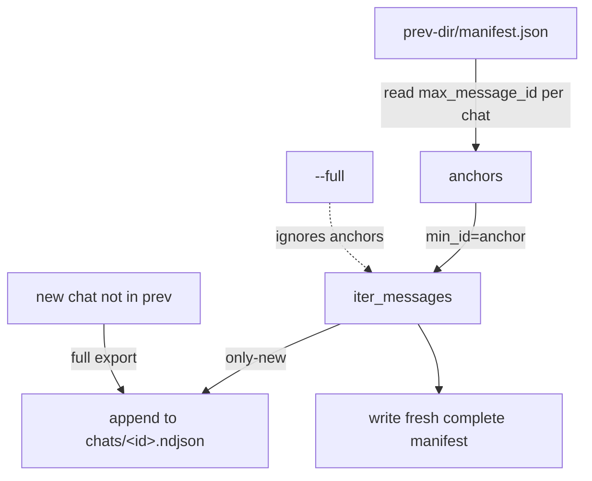

# ADR-0008: Incremental refresh via per-chat message-id anchors, appended in place

## Context and Problem Statement

Re-exporting a full account on every refresh is wasteful; Telegram's stable, monotonic message ids make true incrementality possible. Two questions: how does a refresh know where to resume, and does it append into the existing archive tree or write a separate delta tree msgbrowse merges? (Merge model is a confirmed decision, build brief §13.)

## Decision Drivers

* Cheap refreshes — fetch only messages newer than the last export.
* A simple, resumable on-disk model that matches msgbrowse's staging→adopt flow.
* Safe under device-sync (Syncthing syncs the tree between machines).
* Correctness over cleverness — never miss messages at the boundary.

## Considered Options

* **A — Append-in-place**: `export --since <prev-dir>` reads that dir's `manifest.json`, and for each chat passes its recorded `max_message_id` as Telethon's `iter_messages(min_id=...)`. Only newer messages are fetched and appended to the existing chat ndjson; a fresh complete manifest is written.
* **B — Delta directories**: each refresh writes a new delta tree that msgbrowse merges into its store.

## Decision Outcome

Chosen option: **A — append-in-place**. A refresh reads the prior manifest's per-chat `max_message_id` anchor and resumes via `min_id`, appending only-new lines to each chat's existing ndjson and writing a new complete manifest. New chats not present in the prior manifest export in full. `--full` ignores all anchors and re-exports everything. Append-in-place is simplest, matches msgbrowse's staging→adopt model, and is safe with Syncthing syncing one evolving tree rather than an accumulating pile of delta dirs. Because msgbrowse content-hashes every message and re-import is idempotent, boundary overlap is harmless — when in doubt, include the boundary message. `edit_date` changes on already-exported messages are out of scope for v1 (msgbrowse re-import is id-keyed).

### Consequences

* Good — minimal data fetched per refresh; fast and flood-friendly (with takeout, ADR-0002).
* Good — one evolving tree syncs cleanly; no delta-dir sprawl.
* Good — idempotent re-import means a re-emitted boundary message dedupes, so correctness is easy.
* Bad — edits to already-exported messages are not captured in v1 (documented limitation).
* Neutral — a killed refresh leaves a valid partial tree; re-running `--since` against it resumes.

### Confirmation

An incremental test proves `min_id` anchoring exports only-new messages and safely re-emits a boundary message (asserting idempotent, byte-stable output per ADR-0004). A test asserts a brand-new chat is exported in full on a `--since` run, and that `--full` ignores anchors.

## Pros and Cons of the Options

### A — Append-in-place

* Good — simplest model; matches the consumer's staging→adopt; sync-friendly.
* Good — resumable; boundary overlap is safe under idempotent re-import.
* Bad — no edit tracking in v1.

### B — Delta directories

* Good — each refresh is an immutable, self-contained delta.
* Bad — more moving parts; the consumer must merge; delta dirs accumulate and complicate device-sync.
* Bad — no advantage given msgbrowse already dedupes idempotently.

## Architecture Diagram

## More Information

Anchor fields (`chats[].max_message_id`) live in the manifest per SPEC-0001 and ADR-0003. Takeout/flood behavior is ADR-0002. Determinism/idempotency guarantee is ADR-0004. Confirmed with Joe: append-in-place.
