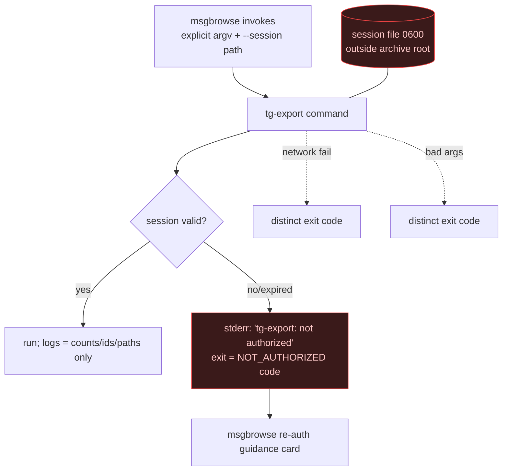

> **Superseded by [ADR-0011](ADR-0011-tdl-raw-transform-pivot.md).** The transform
> holds no session file and opens no network, so the session-security model is moot;
> the exit-code contract shrinks (OK / malformed-arg / malformed-input / runtime). The
> `not authorized` sentinel is retired. Retained for history.

# ADR-0009: Session-file security model and sentinel exit behavior

## Context and Problem Statement

Telethon persists auth keys in a session file (a small SQLite DB) — the sensitive artifact of the whole tool. tg-export is invoked non-interactively by msgbrowse, which needs to distinguish failure classes (especially an expired session) to route the user correctly. How are the session file and secrets guarded, and how does the CLI signal failure classes to its caller?

## Decision Drivers

* Session/auth material, the 2FA password, and the full phone number must never leak into logs or output.
* The caller (msgbrowse) controls where the session lives and must keep it out of the synced archive root.
* msgbrowse must classify failures — an expired/unauthorized session gets a re-auth guidance card, distinct from a network or arg error.
* Machine-greppable, stable diagnostics on stderr.

## Considered Options

* **A — Caller-owned session path + strict secret hygiene + dedicated sentinel exit codes and tokens per failure class.**
* **B — Tool-managed session in a default location + generic non-zero exit on any failure.**

## Decision Outcome

Chosen option: **A**. The session file lives wherever the caller points `--session` (msgbrowse places it in app-support, never inside the synced archive root) and is created `0600`. The tool never prints, logs, or copies session contents, auth keys, the 2FA password, or the full phone number — logs carry counts, ids, and paths only. The only network egress is to Telegram's DCs during `login` and `export`; no telemetry, no third-party calls.

The CLI distinguishes failure classes on stderr so msgbrowse can classify them: an unauthorized/expired session prints a stable token like `tg-export: not authorized` and exits with a **dedicated non-zero code**, distinct from a network error or a malformed-arg error. msgbrowse routes "not authorized" into its re-authorization guidance card. `doctor` verifies a session is valid and authorized, offline-cheap, exiting 0/nonzero accordingly.

### Consequences

* Good — the sensitive artifact is quarantined, `0600`, and never in the synced tree.
* Good — no secret ever reaches logs or the archive.
* Good — the caller can programmatically distinguish "re-auth needed" from other failures.
* Bad — a fixed sentinel-code contract must be defined and held stable (documented in SPEC-0001).
* Neutral — the caller, not the tool, is responsible for the session path being outside the archive root.

### Confirmation

Tests assert: no secret-shaped value (auth key, 2FA, full phone) ever appears in captured logs; the session file is created with `0600`; an unauthorized session yields the `tg-export: not authorized` token and the dedicated exit code; a malformed-arg and a simulated network error yield their own distinct codes. `doctor` returns the right exit status for valid vs invalid sessions.

## Pros and Cons of the Options

### A — Caller-owned path + hygiene + sentinel exits

* Good — strong secret containment; programmatic failure classification for the caller.
* Good — stable, greppable diagnostics.
* Bad — a small exit-code/token contract to define and keep stable.

### B — Tool-managed path + generic failures

* Good — slightly less to specify.
* Bad — risks the session landing in a synced/backed-up location.
* Bad — the caller can't tell "re-auth" from "network down"; worse UX guidance.

## Architecture Diagram

## More Information

Exit-code table and the sentinel token are specified in SPEC-0001 (CLI surface). Credential sourcing is ADR-0006; engine/session origin is ADR-0002. Security invariants trace to the build brief §5.
