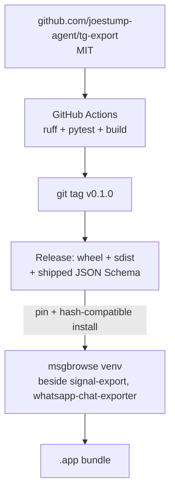

# ADR-0010: Distribution — GitHub-hosted (agent-owned), MIT, pinned pip-installable wheels

## Context and Problem Statement

tg-export is bundled into msgbrowse's Python venv alongside `signal-export` and `whatsapp-chat-exporter` and ships inside a macOS `.app`. It must be a pure-Python, pinned, pip-installable package with tagged releases msgbrowse can pin. Where is it hosted, under what license, and how is it packaged and released? (Host is a confirmed decision, build brief §13.)

## Decision Drivers

* msgbrowse pins a specific version and installs it hash-compatibly (feeds msgbrowse's checksum discipline).
* Pure Python, small dependency tree — it rides inside a `.app`; no compiled extensions.
* Cross-platform (macOS bundle today; Linux/Windows for CLI users).
* A home the automation account can actually create and self-manage (CI, issues, releases).
* Reasonable reach/discoverability for an independently-useful tool.

## Considered Options

* **A — GitHub, agent-owned repo `joestump-agent/tg-export`**, MIT, GitHub Actions CI, tagged wheel releases; add `joestump` as admin collaborator.
* **B — Gitea (gitea.stump.rocks), agent-owned**, matching the primary-Gitea direction (epic #99).
* **C — Both: GitHub primary + Gitea mirror.**

## Decision Outcome

Chosen option: **A — GitHub, agent-owned** (confirmed with Joe). The repo is `github.com/joestump-agent/tg-export` because `joestump` is a personal user namespace the automation account cannot write to directly; the agent account owns the repo and adds `joestump` as an admin collaborator. License is **MIT**. Packaging is a `pyproject.toml` + `src/` layout, package `tg_export`, console entry point `tg-export`, Python ≥ 3.11, dependencies pinned to exact versions (`telethon==<pin>`, `platformdirs` for the session default path, nothing heavy). CI (GitHub Actions) runs ruff + pytest, builds sdist+wheel, and a tag triggers a release job. **Tagged releases** (`v0.1.0`, …) publish wheels so msgbrowse pins a version and installs it hash-compatibly. The JSON Schema files ship inside the package (ADR-0004) so msgbrowse validates against the same contract.

The package has **zero knowledge of msgbrowse**: it imports nothing from it and hard-codes none of its paths (ADR-0001).

### Consequences

* Good — the automation account can create and fully self-manage the repo, CI, issues, and releases now.
* Good — GitHub reach + Actions + release wheels feed msgbrowse's pinned, checksummed installs.
* Good — pure-Python pinned tree stays small enough to bundle in a `.app`.
* Bad — the canonical name is `joestump-agent/tg-export`, not `joestump/tg-export` as the brief header imagined (cosmetic; the `tool` field in the contract is the literal `"tg-export"`, unaffected — ADR-0004/SPEC-0001).
* Bad — off the primary-Gitea path; a Gitea mirror can be added later if desired.

### Confirmation

The repo exists at `github.com/joestump-agent/tg-export` with `joestump` as admin collaborator. CI is green on `main` (ruff + pytest + build). A tag produces a release with a wheel. `pip install` from the wheel exposes the `tg-export` console script and includes the schema files.

## Pros and Cons of the Options

### A — GitHub, agent-owned

* Good — creatable/self-manageable by the automation account today; broad reach; Actions + release wheels.
* Bad — namespace is `joestump-agent/`, not `joestump/`; off the Gitea-primary direction.

### B — Gitea, agent-owned

* Good — matches primary-Gitea direction; single source of truth on your infra.
* Bad — `joestump` is also a user (not org) on Gitea, so it would still be agent-owned (or under the `stumpcloud` org, which is the wrong context for a personal tool); less public reach.

### C — Both (GitHub primary + Gitea mirror)

* Good — reach plus on-infra mirror.
* Bad — more setup and a mirror to keep in sync; unnecessary for v1.

## Architecture Diagram

## More Information

The contract shipped in the wheel is ADR-0004 / SPEC-0001. The delegate-exporter boundary is ADR-0001. Milestone M7 (release v0.1.0) hands the version + schema back to msgbrowse story #209. Confirmed with Joe: GitHub, agent-owned.
