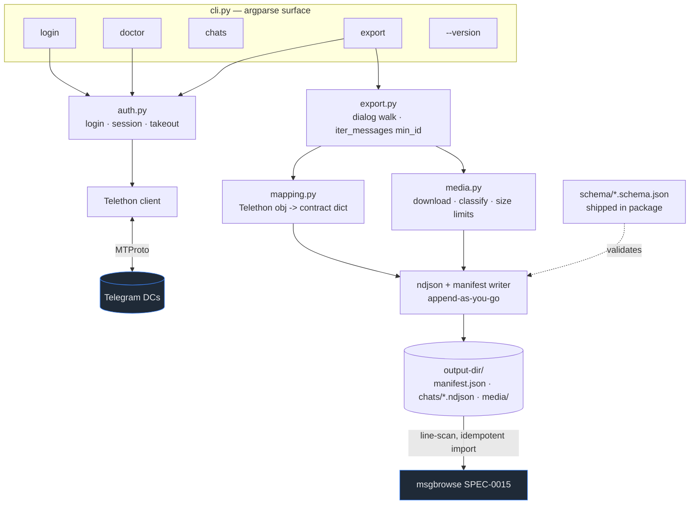

# Design: Telegram JSON Export

## Context

`tg-export` is the Telegram delegate exporter for the msgbrowse ecosystem (ADR-0001). msgbrowse never links a Telegram/MTProto client; it bundles this tool and parses its file output, exactly as it does for Signal, iMessage, and WhatsApp. This document is the architecture and rationale companion to SPEC-0001, which is the authoritative field-level contract. The consuming side is msgbrowse SPEC-0015 (story #209), built to the same `schema_version`.

The design is constrained by four realities: Telegram accounts can be gigabytes; the MTProto session file is sensitive; Telegram rate-limits aggressively (flood-waits); and the output is content-hashed and re-imported idempotently by msgbrowse, which makes determinism a hard requirement rather than a nicety.

## Goals / Non-Goals

### Goals
- Full-fidelity, ingestion-ready JSON: resolved senders, service events, reactions, replies, forwards, resolved link URLs, media.
- Streaming on both write and read sides; crash-resumable; cheap incremental refresh.
- A small, explicit, one-directional contract (`schema_version: 1`) validated by shipped JSON Schema.
- Strong secret hygiene around the session file and credentials.
- Pure-Python, pinned, pip-installable, tagged wheel releases.

### Non-Goals
- Secret chats (device-bound E2E, not reachable via MTProto client APIs) — documented, not attempted.
- Any coupling to msgbrowse internals (SQLite, schema). This tool writes files.
- Sending, editing, deleting, or any write to Telegram. Read-only.
- A GUI, daemon, or scheduler — msgbrowse drives invocation.
- Content transformation beyond flattening (no summarization, no scrubbing).
- Rich inline entity formatting and `edit_date` tracking on already-exported messages (out of scope for v1).

## Decisions

### Delegate exporter, not a msgbrowse module

**Choice**: Standalone `tg-export` tool; msgbrowse ingests its files.
**Rationale**: Honors msgbrowse's "no exporters" rule; quarantines MTProto churn; independently useful and testable. See ADR-0001.
**Alternatives considered**: A Telegram module inside msgbrowse (violates the core rule); forking tdl (drops senders / leaks raw MTProto).

### Telethon over Bot API / Pyrogram

**Choice**: Telethon (MTProto) with a takeout session for the bulk path.
**Rationale**: User-account auth gives full history and resolved senders (the Bot API cannot); `iter_messages(min_id=...)` enables incrementality; takeout eases flood limits. See ADR-0002.
**Alternatives considered**: Bot API (cannot read a user's own dialogs — disqualifying); Pyrogram (no advantage over Telethon for these drivers).

### Directory tree with NDJSON-per-chat

**Choice**: `manifest.json` + `chats/<id>.ndjson` + `media/<id>/…`.
**Rationale**: Bounded memory both sides; append-as-you-go crash-resumability; one bad line skips, never aborts; syncs cleanly over Syncthing. See ADR-0003.
**Alternatives considered**: Single JSON file (whole-file parse, not appendable); SQLite (reintroduces the engine coupling msgbrowse avoids on the delegate side).

### Integer `schema_version` + shipped JSON Schema + determinism

**Choice**: `schema_version: 1` integer major; JSON Schema files shipped in-package; byte-identical re-exports.
**Rationale**: One executable contract both repos validate against; a crisp reject gate; determinism keeps msgbrowse's content-hash dedupe correct. See ADR-0004.
**Alternatives considered**: Prose-only contract (drift found in production); semver string with ranges (fuzzy consumer logic; unnecessary for two coordinated repos).

### Resolve link entities; avoid the UTF-16 trap

**Choice**: Emit `entities[].url`; never emit UTF-16 offsets.
**Rationale**: Telegram entity offsets are UTF-16 code units — an off-by-one corruption source when re-indexed elsewhere. Resolving URLs on the export side means msgbrowse does zero offset math. See ADR-0005.
**Alternatives considered**: Pass through raw offsets (forces the consumer into UTF-16 math); no entities (loses reliable structured link extraction).

### Per-user credential default; append-in-place incremental; non-channel default scope

**Choice**: Per-user `api_id`/`api_hash` by default via flags/env (ADR-0006); `--since` appends into the existing tree via `max_message_id` anchors (ADR-0008); default export excludes channels, opt-in via `--chats` (ADR-0007).
**Rationale**: No embedded secret; simplest merge model matching msgbrowse's staging→adopt and safe under device-sync; bounded, relevant default scope. All confirmed with Joe.

### Caller-owned session + sentinel exit codes

**Choice**: Session lives at the caller's `--session` path, `0600`, never in the archive; distinct exit codes/tokens per failure class.
**Rationale**: Contains the sensitive artifact; lets msgbrowse classify "not authorized" vs network vs arg errors and route re-auth guidance. See ADR-0009.

## Architecture

The export flow is a dialog walk → per-message mapping → NDJSON append, with the manifest written last (complete) each run. Media download is interleaved and best-effort. The writer validates against the in-package JSON Schema so malformed output is caught at the source.

## Risks / Trade-offs

- **Two repos must stay in lockstep on the schema** → shipped JSON Schema is the single source of truth; both sides validate against it; a field change is a coordinated `schema_version` bump.
- **Flood-waits on large first exports** → takeout session + catch/sleep/resume; never fatal.
- **Session-file leakage** → caller-owned path, `0600`, never in the archive, never logged; egress only to Telegram.
- **UTF-16 offset corruption** → offsets never cross the boundary; resolved URLs only.
- **Determinism regressions** (would break msgbrowse dedupe) → golden-file + re-export byte-equality tests in CI.
- **Partial/killed runs** → append-as-you-go leaves a valid partial tree; `--since` resumes.

## Migration Plan

Greenfield — no migration. The build is dependency-ordered across milestones M1–M7 (see the tracker backlog): M1 scaffold + contract (schema + fixtures land first), M2 auth/session, M3 core export, M4 media, M5 incremental, M6 reliability, M7 release v0.1.0. Each milestone is independently reviewable; the schema and fixtures land first so everything downstream is testable against the real contract.

## Open Questions

- Exact pinned Telethon version for v0.1.0 (resolved at M7 during release prep).
- Whether a future `--include-channels` convenience flag is worth adding (v1 uses `--chats` opt-in only; deferred).
- Whether `edit_date` re-export of already-exported messages is worth supporting in a future schema minor (out of scope for v1; msgbrowse re-import is id-keyed).
